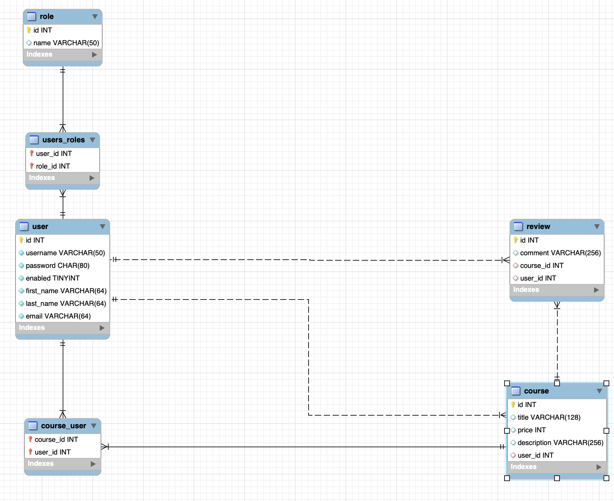
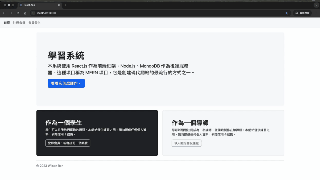
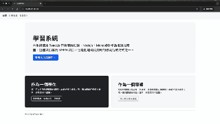

# Learning Service SpringBoot with OAuth2

This program is for RESTful API practice

# Programming Languages
- Java(1.7)
- SQL

# Technologies

- Spring boot background (3.1.5)
- Spring Security
- OAuth2 
- JPA/Hibernate
- MySQL(8.0.22) -> Using [create-schema.sql](https://github.com/percyku/learning-server-springboot-oauth2/blob/master/create-schema.sql) / [create-tables.sql](https://github.com/percyku/learning-server-springboot/blob/master/create-tables.sql) /[create-users-data.sql](https://github.com/percyku/learning-server-springboot-oauth2/blob/master/create-users-data.sql) to create schema / tables /users data

  

# Function

- Member Registration -> Role:Instrutor,Student
- Member Login/Logout
- Member By OAuth2.0 Login with Google & GitHub
- Instructor Create class
- Student Register class
- Student Search class

# RESTful API

You can use postman to test those APIs.

Please follow this [detail](https://github.com/percyku/learning-server-springboot/blob/master/restful-api-operation.md) to operate

# OAuth2

Please get authorizing from [Google](https://console.cloud.google.com/welcome) and [GitHub](https://github.com/settings/developers),
then add client-id & client-secret in Google/GitHub Social login(folder:/main/resources/application.properties)

This function must use front-end website to operate,but my front-end website is not complete yet.
Below gif will show you how to work with front-end website

- Google Login

- GitHub Login

